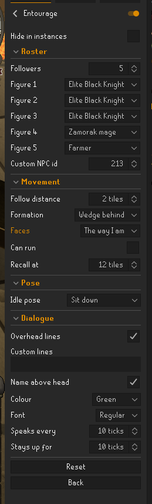

<div align="center">

# Entourage

**You walk through Gielinor alone. This gives you up to five who walk it with you.**

Vannaka, Nieve, the Wise Old Man, a rogue, twenty more — or any NPC id you care
to type. They keep pace with you at a run, arrange themselves in a formation you
pick, hold a pose the moment you stop, and say something over their heads now and
again. Client-side only: no packet is sent, and nothing about any other player is
read.

[](https://runelite.net)
[](https://runelite.net)
[](LICENSE)
[](#development)

</div>

> [!NOTE]
> **Not on the Plugin Hub yet.** Build and run it yourself — see
> [Development](#development) below.


---

## What it does

Up to five figures of your choosing walk with you in formation and hold a pose
the moment you stop, rather than standing there as static, sliding meshes.

- **Twenty-three figures to pick from.** Vannaka, Nieve, Steve, Turael, Duradel,
  Mazchna, the Wise Old Man, a White Knight, an Elite Black Knight, Sir Amik
  Varze, Sir Vyvin, Ghommal, Hans and a dozen more. Every one of them is built
  from the game's own cache and carries the stand and walk animations that NPC
  actually uses — so the ones holding a polearm or a walking stick move like it.
- **Or type an NPC id and get that NPC.** Any of them, not just the twenty-three
  — the plugin reads that NPC's own stand and walk animations straight out of the
  game's cache, so it moves the way it moves in game rather than sliding. An id
  that has no usable pair is refused rather than shipped broken; see *Custom NPC
  ids* below for what that looks like.
- **Keeps up when you run.** A running player covers two tiles a game tick; so
  does the follower, with a proper run animation rather than a walk cycle played
  over twice the ground.
- **Stands where you tell it.** Behind you, ahead of you, on your left or on your
  right, one tile away or two. "Behind" means behind the way you were last
  walking, so turning on the spot doesn't send it circling you.
- **Points the way you want.** At you, the same way you're facing — so it stands
  alongside and looks where you look — or a fixed compass direction. While it's
  walking it faces the way it's walking, whatever you picked.
- **Says things.** Three to seven lines per figure, most of them the NPC's own
  words off the wiki, one at a time, roughly once a minute in a colour and font
  you pick. Or type your own list into the settings box. Or turn it off.
- **Holds the pose you pick.** Its own stand, or dance, cheer, wave, clap, bow,
  shrug, flex, panic, sit, lean, arms crossed, smug or nervous — and it drops
  the pose the moment it starts walking.
- **Doesn't walk through walls.** Every step is checked against the game's own
  real collision data before it's taken — the same primitive the client uses — so
  it can't cut through a doorframe to reach you. A run is two steps, so it's two
  checks. Idle, walking and running are three purpose-built animation
  controllers, and the client itself advances them, so nothing plays doubled.
- **Works in instances too** — a Player Owned House, a raid, anywhere the game
  hands out its own private copy of an area — because its position math is
  self-consistent. There's a switch to hide it in them if you'd rather.
- **Is entirely local.** No packet is sent, nobody else's client draws it, and
  nothing about any other player is read.

## Settings



| Setting | What it does | Default |
|---|---|---|
| **Roster → Followers** | How many figures walk with you, 1 to 5. The figure dropdowns past this number are ignored; RuneLite has no way to blank one, so "how many" and "who" are separate questions. | 1 |
| **Roster → Figure 1**…**5** | Whose body each follower wears — 23 to choose from, each carrying that NPC's own stand and walk. Changing one rebuilds the entourage on the next game tick. | Rogue, Thief, Sorceress, Hero, Necromancer |
| **Roster → Custom NPC id** | Puts *any* NPC in the first slot instead of what "Figure 1" says. Zero means "use the dropdown". Non-human bodies are allowed and may look odd; ids that can't animate are refused. See below. | 0 |
| **Hide in instances** | Takes it off the screen anywhere the game hands out its own private copy of an area: a raid, a quest cutscene, the Inferno. Off by default, because a Player Owned House is an instance too and that's where you'd most want to show a follower off. | Off |
| **Movement → Follow distance** | How many tiles away it stands: 1 or 2. Two gives it room and makes it more likely to get caught on a doorway, because it walks greedily towards its spot rather than pathfinding around obstacles. | 1 |
| **Movement → Stands** | Behind me, ahead of me, on my left, or on my right. Measured against the way you last walked, not the way you're facing — except "Ahead of me", where turning on the spot does send it walking round to the front again. | Behind me |
| **Movement → Faces** | Which way it points once it's stopped: at you, the same way you're facing, or one of the eight compass directions. While it's walking it faces the way it's walking. | At me |
| **Movement → Can run** | Lets it cover two tiles in a game tick when it has fallen behind. Turn it off if you'd rather it never moved faster than a walk — but then a running player outruns it. | On |
| **Movement → Recall at** | How far behind you it may get, in tiles (6–20), before it's put back on your tile instead of walking. This is what stops it being stranded behind a wall it would have to walk *away from* to get around. | 12 |
| **Pose → Idle pose** | What it holds while standing still: the figure's own, or one of thirteen looping emotes and stances. | The figure's own |
| **Dialogue → Overhead lines** | Whether it says anything at all. Turning it off empties the screen on the click rather than when the line up there runs out. | On |
| **Dialogue → Custom lines** | Your own lines, comma-separated. **These replace the figure's own** — empty the box to get them back. See below on commas. | *(empty)* |
| **Dialogue → Name above head** | Draws the figure's name above it, in the same colour and font. When it's talking, the line sits above the name. | Off |
| **Dialogue → Colour** | Magenta, violet, pink, blue, green or red. Deliberately a short list: every one of them is a colour the game never uses for a real menu target or for a player's own chat, which is what stops a follower's line being mistaken for somebody talking. | Magenta |
| **Dialogue → Font** | The game's own three faces: small, regular, or large (the bold one). | Regular |
| **Dialogue → Speaks every** | How often it says something, in game ticks — 100 is a minute, 10 is six seconds. It only ever speaks when it's on screen with nothing already up. | 100 |
| **Dialogue → Stays up for** | How long a line stays on screen, in game ticks — 8 is just under five seconds. Always shortened to less than "Speaks every", because a line that outlasts the gap between lines never clears. | 8 |

Only looping poses are offered, on purpose — a one-shot emote plays once and then
freezes on its last frame, which looks like a bug rather than a pose.

### Custom NPC ids

Type a number into **Roster → Custom NPC id** and the first follower wears that
NPC instead of whichever preset the "Figure 1" dropdown names. Zero — where it
starts — means "use the dropdown". The other four slots keep their dropdowns, so
one typed id and four presets is a legal roster.

**Why it can refuse you.** The twenty-three presets each carry a hand-verified
pair of animations, because the client's NPC data hands over models and colours
and no animation ids at all. An arbitrary id has no such pair, so the plugin
reads that NPC's record out of the game cache itself and takes its stand, its
walk and — if it has one — its run. Plenty of NPCs have nothing usable there:
Spria declares no animations at all, Krystilia's stand and walk are the *same*
id. A follower given either would slide along the ground, which is the single
most visible way this plugin can look broken, so it doesn't ship one.

**What a refused id looks like.** The follower is the "Figure 1" dropdown's
figure — so if you type an id and the Rogue is still standing there, the id was
turned down. There is a line in the client log saying which id and why. The three
ways to get one: no such NPC in the cache, a record the plugin can't read, and a
record whose animations are missing, half-missing or identical.

**What an id that isn't refused still can't do.** Anything non-human renders at
its default size on a one-tile footprint — a big NPC won't be big, and won't
reserve the tiles it should — and its animations sit on whatever skeleton the
cache gives it, which this plugin cannot check without the game running. Only a
live client can tell you whether a particular body looks right walking. If
**Name above head** is on, a working id draws that NPC's own name and a refused
one draws the dropdown figure's, which is the quickest way to tell them apart.

**If nothing appears at all**, the id exists and animates but its models won't
build — an NPC with no models of its own. Clear the box.

**One id, first slot only.** Five numbered boxes would double the roster section
to describe something the four other dropdowns already do; mixing one typed id
with presets is the case that was asked for.

### About the lines

**Most of them are the NPC's own words, and the rest are ours — here's which.**
Eleven figures have dialogue recorded on the [Old School RuneScape
Wiki](https://oldschool.runescape.wiki), and their lines are quoted from it
exactly: **Vannaka, Nieve, Steve, Turael, Duradel, Mazchna, the Wise Old Man,
Hans, Sir Amik Varze, Sir Vyvin and Ghommal**. The other twelve — the rogue, the
thief, the farmer, the knights, the mages — are generic bodies out of the cache
with no recorded speech at all, so **their lines were written for this plugin**.
Nothing here is a paraphrase presented as a quote.

Two notes on the quoted ones. The six slayer masters share a script in game —
*"'Ello, and what are you after then?"* and two more are word for word the same
on all of them, and Nieve, Duradel and Mazchna have almost nothing else short
enough to draw over a head. And Sir Amik's lines come from the quests he speaks
in, because his own page is flagged incomplete.

**Commas** split the custom-lines box, with no escape — a line of your own can't
contain one, so use a dash. (The shipped lines can, because they aren't typed in
there.) Lines are trimmed, blanks dropped, anything past 60 characters cut, and
the first twelve used. **Only one line is ever on screen**, however many figures
walk with you later: a companion that never shuts up is worse than one that says
nothing.

## Why

The brief was three words wide: *"group of people follow you or post up cool
anime style."* The first slice was one figure walking correctly, because a
working walk cycle and honest wall-awareness turned out to be the two hardest
problems in a follower plugin. Everything since hangs off it: who the figure is,
where it stands, which way it points, and now what it says. Every model comes out
of the game's own cache; nothing copyrighted or trademarked is imitated, named or
reproduced. The technique is inherited from
[`../lively-cities`](../lively-cities), the same author's cosmetic-humanoid
plugin live on the Plugin Hub.

## Known limitations

- **This is greedy stepping, not pathfinding.** A follower tries the diagonal
  toward its spot, then each straight-line component; if none is legal it stands
  still, and it can get stuck on the wrong side of a wall it would need to walk
  *away from* to get around. The recall distance is what stops that being
  permanent. Setting the follow distance to two makes it a little more likely,
  because a spot two tiles out is more often on the far side of something.
- **A recall is still a pop, not an entrance.** The follower appears on your tile
  and steps off it the next tick. It happens far less than it used to — a
  follower that can run is not outrun by a running player — but a proper entrance
  effect is later work.
- **Five is the ceiling**, and only one line is ever on screen however many walk
  with you — a group that all talk at once is noise rather than company.
- **"Ahead of me" circles you when you turn on the spot.** The slot is a tile
  along the way you last walked, so turning round leaves the follower behind you
  and it walks back to the front. That is the honest consequence of asking for a
  figure in front; the other three slots don't do it.
- **The lines don't know what you're doing.** They're a rotation on a timer, not
  a reaction — nothing here reads your skills, your location or your quest state,
  and nothing ever will read anything about anybody else.
- **It cannot wear your own outfit.** The game exposes no single call that turns
  a player's equipped items into a buildable model array the way it does for
  NPCs. There *is* a cache decoder in here now, and it is deliberately no help:
  it reads four animation ids out of one NPC record and knows nothing about
  items.
- **You cannot mix a pose with walking**, and you cannot right-click the figure
  at all. The client's second animation slot is never advanced for a plugin-drawn
  object, so a walk parked in it would freeze on its first frame; and a menu entry
  needs the deprioritised, clearly-labelled treatment `../lively-cities` gives its
  citizens, which hasn't been built here yet.
- **A typed NPC id is not checked for whether it looks good**, only for whether
  it can be made to walk. Size, footprint and skeleton are all left at the
  defaults every preset uses, which are right for a human and are not right for a
  dragon. See *Custom NPC ids* above.
- **Its frame cost hasn't been measured.** With one mostly-moving figure there is
  nothing to compare against `../lively-cities`' numbers, which describe a
  mostly-*idle* crowd instead.

## Found a bug?

Please open an issue on GitHub. The most useful report says where you were
standing, what you expected the follower to do, and whether it was walking or
holding a pose at the time. If it's a crash or a figure that never appears,
`~/.runelite/logs/client.log` filtered to `entourage` usually shows why.

---

## Development

```bash
./gradlew build     # compile and run the 460 tests
./gradlew test      # tests only, every name printed
./gradlew run       # launch a dev client with the plugin loaded
```

`./gradlew run` starts RuneLite with `--developer-mode --debug`. Log in with a
Jagex account per RuneLite's own
[Using Jagex Accounts](https://github.com/runelite/runelite/wiki/Using-Jagex-Accounts)
guide.

The client version is pinned in `build.gradle` (1.12.38) rather than tracking
`latest.release`, so a local build is reproducible. The Plugin Hub's packager
substitutes its own, so the pin affects local builds only. **Filing the Hub
submission?** Swap the "not on the Plugin Hub yet" callout above for install
instructions in the same change.

### Testing discipline

Every guard here is proven by deliberately breaking the thing it claims to catch
and confirming the test goes red first, with the mutation shown to have landed
rather than assumed. Seven passes so far — 51, 117, 26, 52, 31, 64 and most
recently 80 mutations — have turned up twenty real gaps, all covered now,
including a square test fixture whose geometry had been hiding six axis-mix-up
bugs, and a test that took its expected value from the very constant it was
checking, so the cap it was named for could be raised to 99 without it going red.
The newest pass found five of its nine gaps in the same shape: **one rule written
twice**, in two places that each answered for the other, so that neither copy
could be broken on its own. Every one of those was collapsed to a single
falsifiable copy rather than left as coverage that was not there. Two survivors
remain that no test can catch, both written up as equivalent mutants where they
live. The case-by-case detail sits in the test source beside each guard.

### Wanted from a real client

Nothing below can be settled without the game running, and none of it is guessed
at in the code — each is stated as an open question exactly where it lives:

1. **Does the run read as a run on the Tier B figures?** Every preset's stand and
   walk were read off the NPC that plays them; the *run* was not, because those
   NPCs never run. It sits on the same human framemap, so the geometry is sound —
   what is unverified is whether a figure holding a halberd running with its arms
   swinging free looks acceptable. `EntourageFigure`'s constructor is the one
   place to change if not.
2. Does the walk read as a walk — frame pacing, and one tile per game tick?
3. Does a follower that runs still get recalled in practice, and if so where?
4. Is one tile of following distance too close, and does two feel better?
5. Do the sitting and lying poses put the figure at the right height?
6. **Are the three fonts legible over a head at a normal zoom**, and is the text
   height right for a human-scale figure? Both are judgements, and the font
   mapping is the one line of this plugin no test exercises.
7. **Does the cache decoder read a real record?** Every byte width in it is
   transcribed from `runelite-cache`'s own `NpcLoader` and pinned by tests
   against records this repo writes itself, which proves the widths agree with
   that loader and not that the client hands back what that loader expects. One
   working typed id settles it.
8. **What does an arbitrary NPC actually look like following you?** Non-human
   bodies render at human scale on a one-tile footprint, and their animations sit
   on whatever skeleton the cache gives them. Nothing here can judge either.

## License

BSD 2-Clause. See `LICENSE`.

---

<div align="center">
<sub>Cosmetic and local. Sends nothing to the server. Not affiliated with Jagex.</sub>
</div>
